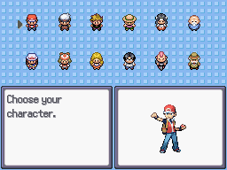
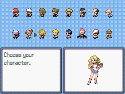

# Character Selection
This plugin is for Pokémon Essentials. It's a character selection screen suggested for player selection or partner selection.

## Screens

## Installation
Follow FL's [Essentials plugin installation instructions](https://github.com/FL-/Misc/tree/main/Guides/EssentialsInstallPlugin). For Essentials version 18.1 or lower, put the script above main.

## How to Use
Look at [Script](/Content/Plugins/Character%20Selection/001_Character%20Selection.rb) for instructions.

## Download
